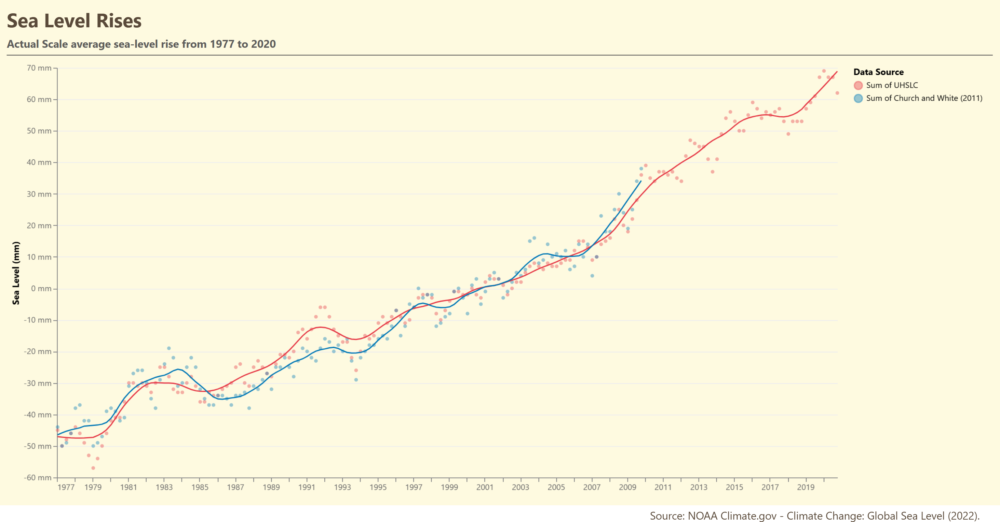
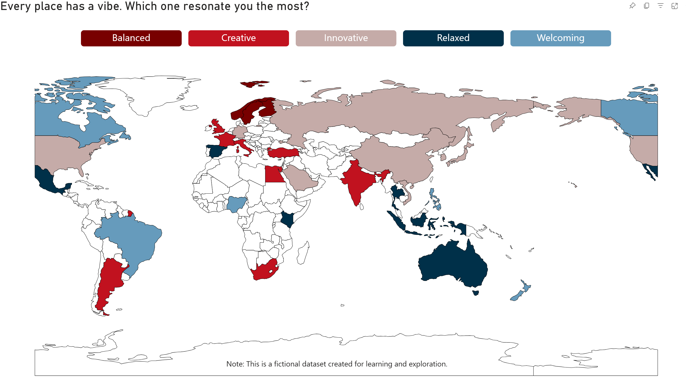

## Report 1 - Sea Level Rises
[Power BI App](https://app.powerbi.com/view?r=eyJrIjoiMzc4YWY4NmUtZDZiMi00YzY2LTk0ZGYtN2ViZDRlNDZlOGM2IiwidCI6ImVlZGE2ZTc3LWZkZjMtNGYwMS04OWEwLTQ5Zjk2NDgwMGJjYyIsImMiOjZ9)  



### Skills Demonstrate
Using Vega-lite code to create custom Deneb chart, the combination of line charts and scatterplot displays the sea level rising from 1977 to 2020. The combined line‑and‑point design makes it easy to see both the long‑term upward trend and the year‑to‑year variability in sea levels.
```json  
  "layer": [
    {
      "mark": {
        "type": "point",
        "tooltip": true,
        "filled": true,
        "opacity": 0.4,
        "size": 20
      },
      "encoding": {
        "x": {
          "field": "Time",
          "type": "temporal",
          "title": null,
          "axis": {
            "format": "%Y",
            "labelAngle": 0,
            "grid": false,
            "tickCount": "year",
            "labelColor": "#666666"
          }
        },
        "y": {
          "field": "Sea Level",
          "type": "quantitative",
          "title": "Sea Level (mm)",
          "axis": {
            "grid": true,
            "gridColor": "#eeeeee",
            "labelColor": "#666666",
            "labelExpr": "datum.value + ' mm'"
          }
        },
```
 - Deneb allows to build visuals that are impossible with native Power BI charts. Vega‑Lite gives full control over marks, layers, scales, tooltips, and interactions, enabling pixel‑perfect custom visualizations inside Power BI.     

### Raw Dataset
- Retrieved on January 28, 2024
- Source: https://ourworldindata.org/grapher/sea-level?time=earliest..2020-10-15
- Data source: NOAA Climate.gov (2022) – processed by Our World in Data

## Report 2 - Map
[Power BI App](https://app.powerbi.com/groups/me/reports/536ce698-5b93-4721-a9a0-1b5e0b082d2a/50b4ecae9bbc6b079046?experience=power-bi)  



### Skills Demonstrate: 
1. Shape Map 
2. Custom TopoJSON 
3. Slicer Formatting 
4. Power BI Theme JSON 
5. Conditional Formatting

Applying a custom TopoJSON file to Shape map that contains the geographic boundaries (at 110m resolution) to outline all countries in the world.
- **Challenge:** Power BI's native Shape Map couldn't display multiple category colors simultaneously when multi-selecting filters.
- **Solution:** Implemented a custom TopoJSON file at 110m resolution to provide accurate geographic boundaries while maintaining full color control per category.

### Raw Dataset
- A fictional dataset created for learning and exploring data visualization.