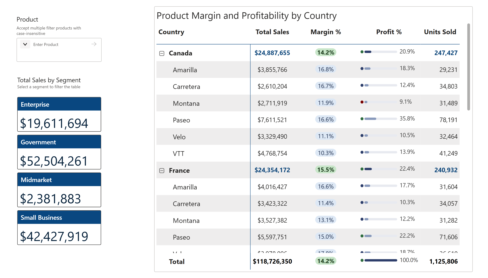

## Report 1 - Sea Level Rises
[Power BI App](https://app.powerbi.com/view?r=eyJrIjoiMzc4YWY4NmUtZDZiMi00YzY2LTk0ZGYtN2ViZDRlNDZlOGM2IiwidCI6ImVlZGE2ZTc3LWZkZjMtNGYwMS04OWEwLTQ5Zjk2NDgwMGJjYyIsImMiOjZ9)  


### Skills Demonstrate
Using Vega-lite code to create custom Deneb chart, the combination of line charts and scatterplot displays the sea level rising from 1977 to 2020. The combined line‑and‑point design makes it easy to see both the long‑term upward trend and the year‑to‑year variability in sea levels.
```json  
  "layer": [
    {
      "mark": {
        "type": "point",
        "tooltip": true,
        "filled": true,
        "opacity": 0.4,
        "size": 20
      },
      "encoding": {
        "x": {
          "field": "Time",
          "type": "temporal",
          "title": null,
          "axis": {
            "format": "%Y",
            "labelAngle": 0,
            "grid": false,
            "tickCount": "year",
            "labelColor": "#666666"
          }
        },
        "y": {
          "field": "Sea Level",
          "type": "quantitative",
          "title": "Sea Level (mm)",
          "axis": {
            "grid": true,
            "gridColor": "#eeeeee",
            "labelColor": "#666666",
            "labelExpr": "datum.value + ' mm'"
          }
        },
```
 - Deneb allows to build visuals that are impossible with native Power BI charts. Vega‑Lite gives full control over marks, layers, scales, tooltips, and interactions, enabling pixel‑perfect custom visualizations inside Power BI.     

### Raw Dataset
- Retrieved on January 28, 2024
- Source: https://ourworldindata.org/grapher/sea-level?time=earliest..2020-10-15
- Data source: NOAA Climate.gov (2022) – processed by Our World in Data

## Report 2 - Interactive World Map: Every Place Has a Vibe
A fictional dataset that assigns each country a dominant vibe, this map visualize how a single category can reveal something interesting across the world.
[Power BI App](https://app.powerbi.com/groups/me/reports/536ce698-5b93-4721-a9a0-1b5e0b082d2a/50b4ecae9bbc6b079046?experience=power-bi)  


### Skills Demonstrate: 
**What I built:**
- Configured Shape Map with a custom TopoJSON file (ne_110m_admin) containing geographic boundaries at 110m resolution to accurately outline all world countries:
    1. Downloaded the Admin 0 Countries shapefile at 110m resolution from Natural Earth Data (naturalearthdata.com)
     
    2. Converted the shapefile (.shp) to TopoJSON format using Mapshaper (mapshaper.org): an online tool that accepts shapefiles and exports them as TopoJSON/GeoJSON:
     - Uploaded all shapefile components (.shp, .dbf, .prj, .shx) together into Mapshaper
     - Exported as TopoJSON format (.json)
     
  3. Loaded the converted TopoJSON file into Power BI Shape Map:
     - Format pane → Map settings → Add a map type
     - Uploaded the ne_110m_admin.json file
     - Set projection to Equirectangular for standard world view
     
  4. Matched country names in the dataset to the TopoJSON geographic features to ensure correct country boundary mapping

- Mapped 30+ countries across 5 vibe categories (Balanced, Creative, Innovative, Relaxed, Welcoming) with distinct colors per category
- Solved multi-select color conflict by placing Vibe in the Legend field: maintaining individual category colors when multiple vibes are selected simultaneously
- Built interactive tile slicer buttons styled with conditional formatting to match each vibe's distinct color identity
- Configured auto-zoom on selection to focus the map view on selected vibe countries

1. Shape Map 
2. Custom TopoJSON 
3. Slicer Formatting 
4. Power BI Theme JSON 
5. Conditional Formatting

**Challenge:** Power BI's native Shape Map couldn't display multiple category colors simultaneously when multi-selecting filters.

**Solution:** Implemented a custom TopoJSON file at 110m resolution to provide accurate geographic boundaries while maintaining full color control per category.

### Raw Dataset
- A fictional dataset created for learning and exploring data visualization.

## Report 3 - Financial Matrix - Product Margin and Profitibility by Country
Using Scalable Vector Graphics (SVG), an XML-based language and a web-standard format for drawing pill badges and percentage data bars. Visualizing sales by segments and product margin and profitability by country subtotals and product details row.
[Power BI App](https://app.powerbi.com/view?r=eyJrIjoiMDMwMjBjMjAtYjA4MC00ODJjLWIyMjMtNmZjYTQ2NDU1MzQ5IiwidCI6ImVlZGE2ZTc3LWZkZjMtNGYwMS04OWEwLTQ5Zjk2NDgwMGJjYyIsImMiOjZ9)  



### Skills Demonstrate: 
**What I built:**
- Designed a matrix with expandable Country → Product hierarchy showing subtotal and detail rows with distinct visual treatments
- Used ISINSCOPE() DAX function to detect row context and dynamically switch visual rendering within a single column
- Created SVG-based pill badges using DAX string measures to display Margin %: green pills for country subtotals, blue pills for product detail rows
- Built dynamic SVG data bars with color-coded dot indicators for Profit % column: dot color changes based on thresholds (green ≥20%, blue ≥10%, grey below 10%)
- Applied conditional formatting to Total Sales column: bold blue for country subtotals, standard grey for product rows
- Integrated a Text Filter visual for case-insensitive multi-product search filtering
- Built segment cards showing Total Sales per segment using New Card visual with custom header styling

**Key DAX techniques:**
1. DAX
2. SVG
3. Matrix/Conditional Formating
4. Input Filter
5. New Card Visual

- ISINSCOPE(): row context detection
- SVG string measures: inline data visualization
- data:image/svg+xml URI encoding: image rendering in matrix
- FORMAT(): dynamic percentage display
- NOT ISINSCOPE(): subtotal detection